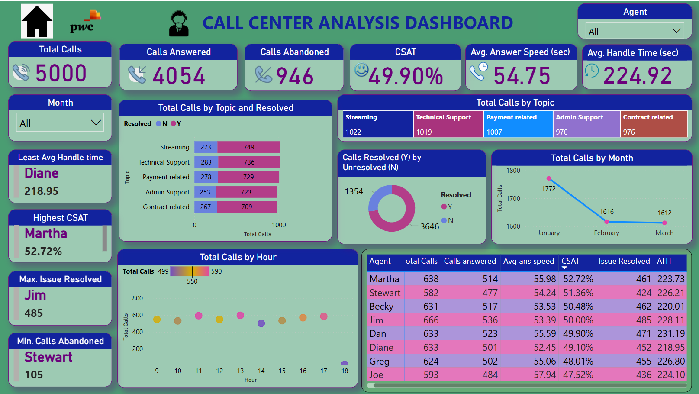

# 📞 Call Center Analysis Dashboard – PwC Virtual Internship Project

## 📝 Overview

This Power BI dashboard was developed as part of the **PwC Switzerland Virtual Internship** on the Forage platform. The project focuses on analyzing call center operations to evaluate agent performance, customer satisfaction, and operational efficiency. It is designed to help identify areas for improvement and support data-driven decision-making.

---

## 🔗 Live Dashboard

👉 **[View Live Power BI Dashboard](https://app.powerbi.com/view?r=eyJrIjoiZDRkYTc1NGMtY2ViNS00YjIxLTkyYjYtM2U1MmEyN2ViYmM5IiwidCI6IjRmYzg3Zjg4LTAxMzctNDQyNC04MmI1LTIzYzRmMTVmMzllYyJ9)**  

---

## ❗ Problem Statement

Call centers receive thousands of customer queries daily, and it's vital to maintain high standards of responsiveness, resolution rates, and customer satisfaction. The challenge lies in:

- Monitoring KPIs like Call Volume, CSAT, Handle Time, and Resolution Rate.
- Identifying top and low-performing agents.
- Detecting trends in call volume by time, topic, and resolution status.
- Recommending improvements based on data-driven insights.

---

## 🛠 Tools Used

- **Power BI Desktop** – Dashboard creation, modeling, and DAX measures.
- **Power Query Editor** – Data transformation and cleaning.
- **Microsoft Excel** – Raw data source.
- **DAX** – Custom measures and KPIs (e.g., CSAT%, AHT, issue resolution rate).

---
## Key Performance Indicators (KPIs)
The following KPIs are tracked and analyzed for continuous improvement:

- **Average Handle Time (AHT):**  
  Measures the average time spent by agents on a customer call (talk time, hold time, wrap-up).

- **First Call Resolution (FCR):**  
  Tracks the percentage of customer issues resolved during the first interaction, reducing the need for follow-up calls.

- **Customer Satisfaction Score (CSAT):**  
  Captures customer satisfaction based on post-call surveys.

- **Net Promoter Score (NPS):**  
  Measures customer loyalty by evaluating the likelihood of customers recommending the service to others.

- **Service Level:**  
  The percentage of calls answered within a specified time, e.g., 80% of calls answered within 30 seconds.

- **Abandonment Rate:**  
  Tracks the percentage of calls where customers hang up before speaking to an agent.

- **Agent Utilization Rate:**  
  Indicates the proportion of time agents are actively handling calls versus idle time.

- **Call Volume:**  
  The total number of calls received by the call center within a specific period.

- **Occupancy Rate:**  
  Measures how much time agents spend actively engaged with calls compared to their total available time.

- **Call Transfer Rate:**  
  The percentage of calls that require transferring to another agent or department.

- **Response Time:**  
  The average time taken for agents to respond to the customer’s initial query.
---
## 🔍 Insights

- 🔍 **CSAT (Customer Satisfaction)** is low at **49.90%**, indicating service dissatisfaction.
- 🔍 The majority of calls are **unresolved (72.9%)**, which strongly correlates with low CSAT.
- 🔍 Highest call volumes were for **Streaming** and **Technical Support** topics.
- 🔍 **Jim** resolved the most issues (**485**), while **Diane** had the lowest **average handle time**.
- 🔍 Peak call hours are between **12 PM and 3 PM**, requiring optimal staffing during these times.

---

## 💡 Recommendations

- 💡 **Improve resolution rate** by upskilling agents and optimizing the ticket triage process.
- 💡 **Conduct training sessions** for agents with high call abandonment or low CSAT scores.
- 💡 **Boost customer satisfaction** by reducing average handle and answer times.
- 💡 **Reschedule agent shifts** to better align with peak call hours.
- 💡 **Investigate unresolved calls** by topic to find root causes and apply corrective action.

---

## 🧠 Key Learnings

- Gained hands-on experience building interactive dashboards using **Power BI**.
- Learned to translate raw data into **actionable business insights**.
- Strengthened skills in **DAX**, **Power Query**, and data visualization best practices.
- Developed a holistic understanding of **call center operations** and performance metrics.
- Practiced creating **executive-level reports** with clear recommendations.

---

## 📸 Dashboard Preview

---

